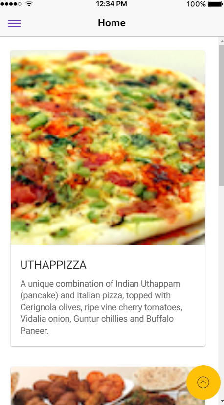
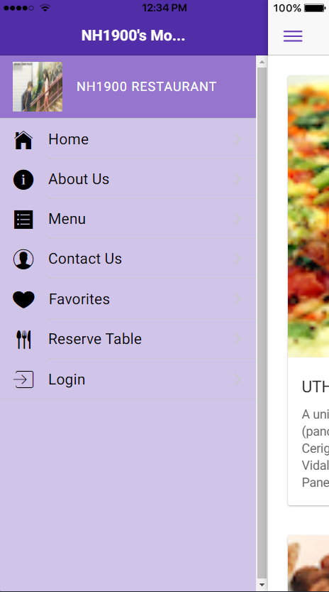

[](https://github.com/NH1900) 
[](https://github.com/NH1900)

# Catalog
* [Background](#background)
* [Usage](#usage)
* [Content](#content)
    * Home
    * About us
    * Contact us
    * Favorites
    * Menu
    * Resevr Table
    * Log in
* [Future](#future)

# Background
If students have heavy load on school assignments,they may not have time cooking.So for their convenience,I design this Online Restaurant
Ordering System. Each account is corresponding to a specific user. Each user can browser what dishes they like and order them.Based on users' ordering history, we will recommend some dishes to him next time he want to order a dish.
# Usage
## Restaurant

### Installation
Please make sure latest Node 6 LTS and NPM 3+ are installed.

Then, install the CLI globally (you may need sudo):

$ npm install -g ionic@latest
You can verify your installation with the ionic --version command.

### Getting Started
Start a new Ionic project using ionic start:

$ ionic start myNewProject
ionic start will prompt you to select a “starter”. We recommend using the tutorial starter for your first app. See Starter Templates for a full list.

After selecting a starter, the CLI will create a new app named myNewProject. Once you cd into your project’s directory, a few new commands become available to you, such as ionic serve:

$ cd ./myNewProject
$ ionic serve
While running ionic serve, changes you make to your app code will automatically refresh the browser. If you want to see your app on a device or emulator, you can use Cordova.

You can list available commands with the ionic --help command.

### Using Cordova
Integrate Ionic with Cordova to bring native capabilities to your app.

$ npm install -g cordova
$ ionic cordova --help
$ ionic cordova run ios
The ionic cordova commands (aside from ionic cordova resources) wrap the Cordova CLI. You can read about the differences in each command’s --help page. To learn more about the commands, see the Cordova CLI Reference documentation.

For iOS development, see the iOS Platform Guide.
For Android development, see the Android Platform Guide.
Ionic Pro
Ionic Pro is a powerful suite of tools and services designed for the entire app lifecycle, all in one integrated experience. Ionic Pro is fully supported in the Ionic CLI. See the Pro Docs to get started.

Ionic Cloud (legacy) will be supported until its end-of-life on January 31st, 2018. Until then, you can switch between Ionic Cloud and Ionic Pro with ionic config set -g backend legacy and ionic config set -g backend pro. Unfortunately, you’ll need to re-authenticate with ionic login each time the backend mode is switched.

### Troubleshooting
If you’re having trouble with the Ionic CLI, you can try the following:

Make sure you’re on the latest version of the CLI. Update with npm update -g ionic.
Try running commands with the --verbose flag, which will print DEBUG messages.

# Content
In following parts, main function and part of code will be showed.
## Home
In the home page, users can find specialty dishes and related introduction. If users like them, they can directly slide images of dishes to add them to favorites dishes list.
To display images and related data from backend,invoking serveral services to obtian the observable of target data. 
```Typescript
constructor(public navCtrl: NavController,
    private dishservice: DishProvider,
    private promotionservice: PromotionProvider,
    private leaderservice: LeaderProvider,
    @Inject('BaseURL') private BaseURL) { }

  ngOnInit() {
    this.dishservice.getFeaturedDish()
       .subscribe(dish => this.dish = dish,
        errmess => this.dishErrMess = <any>errmess );
    this.promotionservice.getFeaturedPromotion()
      .subscribe(promotion => this.promotion = promotion,
        errmess => this.promoErrMess = <any>errmess );
    this.leaderservice.getFeaturedLeader()
      .subscribe(leader => this.leader = leader,
        errmess => this.leaderErrMess = <any>errmess );

  }
```
## About us
In about us page, users can find all information about our restaurant including the history of the restaurant or the information about users.
## Contact us
In the Contact us page, users can fill out their information and find our phone number or email.
Just for example,in contact us page,this is the way of defining email format for users.
```Typescript
constructor(public navCtrl: NavController, public navParams: NavParams,
    private emailComposer: EmailComposer) {
  }

  sendEmail() {

    let email = {
      to: 'confusion@food.net',
      subject: '[ConFusion]: Query',
      body: 'Dear Sir/Madam:',
      isHtml: true
    };

    // Send a text message using default options
    this.emailComposer.open(email);
  }

  ionViewDidLoad() {
    console.log('ionViewDidLoad ContactPage');
  }
```
## Menu
In the side Menu,users can switch to different pages their want.
There are two functions here. One for adding to favorites list;the other for chekcing whether this dish being selected
```Typescript
dishSelected(event, dish) {
    // That's right, we're pushing to ourselves!
    this.navCtrl.push(DishdetailPage, {
      dish: dish
    });
  }
  addToFavorites(dish: Dish) {
    console.log('Adding to Favorites', dish.id);
    this.favoriteservice.addFavorite(dish.id);
    this.toastCtrl.create({
      message: 'Dish ' + dish.id + ' added as a favorite successfully',
      duration: 3000
    }).present();
  }
```
## Favorites
In Favorites page, after users choose what they like, those dishes they choose will be added into favorites list. And all choosing history will be recorded and next time, similar dishes will be recommended to users.
If users want to delete some dishes from favorites list, several warning messages will occur to make sure the dish this user choose is the one he/she really want to delete.
```Typescript
deleteFavorite(item: ItemSliding, id: number) {
    console.log('delete', id);

    let alert = this.alertCtrl.create({
      title: 'Confirm Delete',
      message: 'Do you want to delete Dish '+ id,
      buttons: [
        {
          text: 'Cancel',
          role: 'cancel',
          handler: () => {
            console.log('Delete cancelled');
          }
        },
        {
          text: 'Delete',
          handler: () => {
            let loading = this.loadingCtrl.create({
              content: 'Deleting . . .'
            });
            let toast = this.toastCtrl.create({
              message: 'Dish ' + id + ' deleted successfully', 
              duration: 3000});
            loading.present();
            this.favoriteservice.deleteFavorite(id)
              .subscribe(favorites => {this.favorites = favorites; loading.dismiss(); toast.present(); } ,
                errmess =>{ this.errMess = errmess; loading.dismiss(); });
          }
        }
      ]
    });
  
    alert.present();

    item.close();

  }
```
## Reserve Table
After users ordering some meal,In the Reserve Table page, users can check whether dishes they choose are really what they want.
Users can submit their ordering by clicking submit button 
```Typescript
onSubmit() {
    console.log(this.reservation.value);
    this.viewCtrl.dismiss();
  }
```
## Log in
In log In page users can create an account or sign in to our restaurant.
The code piece showing below is for checking users information and limiting the input of users
```Typescript
constructor(public navCtrl: NavController, public navParams: NavParams,
    public viewCtrl: ViewController,
    private formBuilder: FormBuilder,
    private storage: Storage ) {
      storage.get('user').then(user => {
        if (user) {
          console.log(user);
          this.user = user;
          this.loginForm
            .patchValue({
              'username': this.user.username, 
              'password': this.user.password 
            });
        }
        else
          console.log('user not defined');
      });
      this.loginForm = this.formBuilder.group({
        username: ['', Validators.required],
        password: ['',Validators.required],
        remember: true
      });
  }

```
# Future
For this project, I migrate Online restaurant project to Hybrid Mobile platform.So I use Ionic and Cordova framework to invoke some local features of mobile device such as:Splash Screen plugin, Notifying plugin or Social Sharing plugin...
In the future based on customers' requirements I will add more functionalities based on Cordova framework to invoke more native features of mobile devices.

